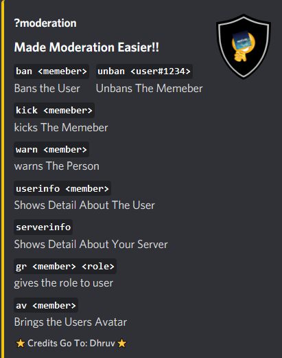

# Moderation



All The Command's Need Certain **Permission** Which Is By Default Given To Bot All The Moderation Command Can Be Used By Respective Perms .  
  
Exception : Avatar Command Doesn't Need To Permission To Use.   


## Ban Command

```dart
?ban @member
```

## UnBan Command

```dart
?unban user#1234
```

## Kick Command

```dart
?kick @member
```

## Warn Command

```dart
?warn @member
```


## Info About User Command

```dart
?userinfo @member
```

## Give Role To Member

```dart
?gr @memeber @role
```

## Get Members Avatar

```dart
?av @member
```

